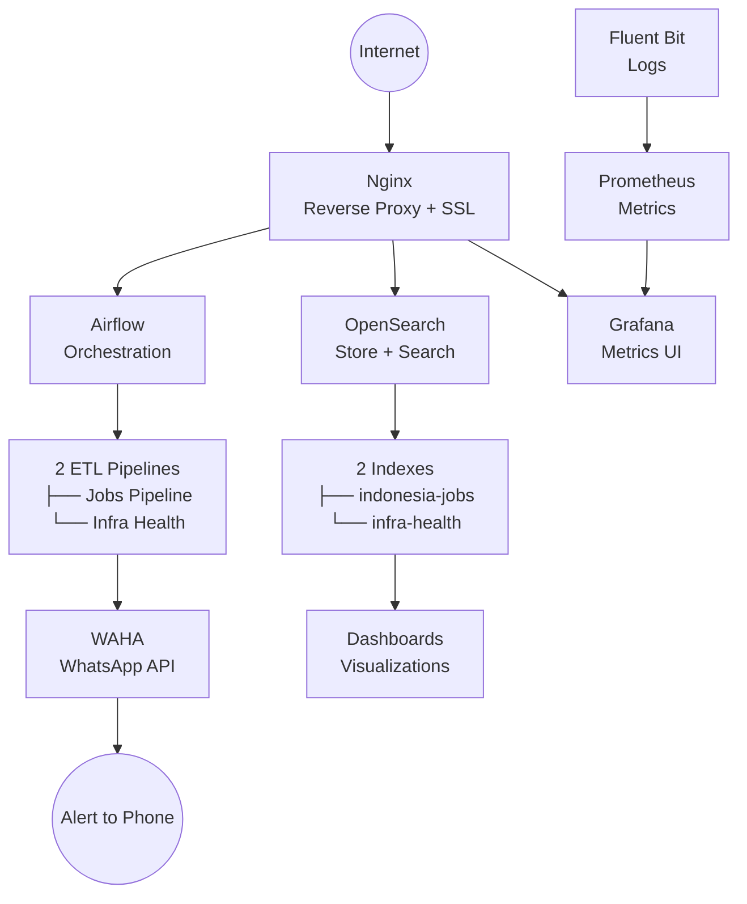
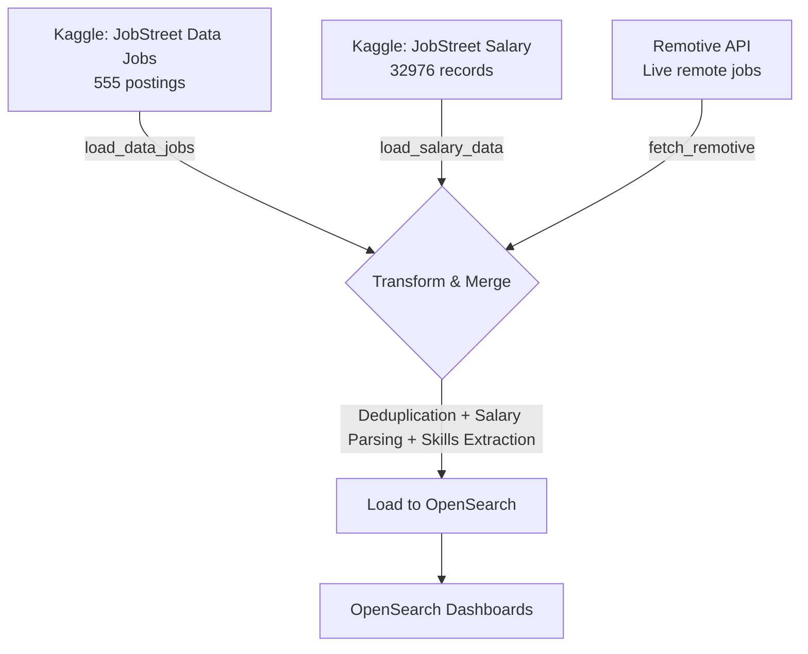
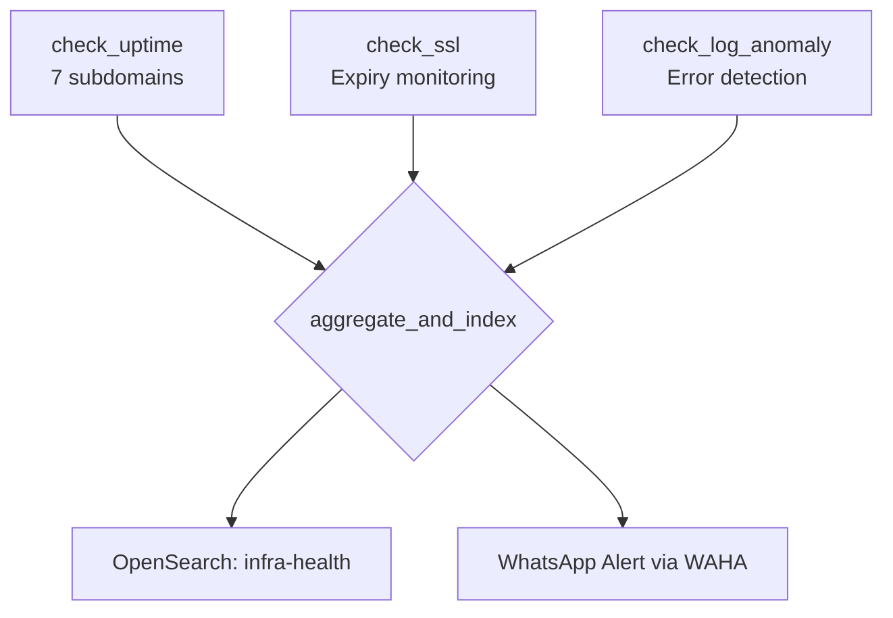

```markdown
# 🇮🇩 Indonesia Data Jobs Intelligence Pipeline

[](https://github.com/ChaisarAbi/indonesia-jobs-pipeline/actions/workflows/ci.yml)
[](https://github.com/ChaisarAbi/indonesia-jobs-pipeline/actions/workflows/deploy.yml)
[](https://opensource.org/licenses/MIT)
[](https://www.python.org/downloads/)
[](https://airflow.apache.org/)
[](https://opensearch.org/)

A **production-grade data & infrastructure platform** built on a single Linux VPS. Features two automated Airflow pipelines, a full observability stack, CI/CD with GitHub Actions, WhatsApp alerting, and Kubernetes manifests.


---

## 🏗️ System Architecture


## Continue to the Pipelines

---

## 📊 Pipeline 1 — Indonesia Data Jobs Intelligence

Collects, transforms, and indexes Indonesian job market data from multiple sources to provide actionable insights.



### Key Insights from 563 Job Postings

| Insight | Finding |
| :--- | :--- |
| 🛠️ **Most Demanded Skill** | Excel (212 postings), SQL (159), Power BI (97) |
| 💰 **Highest Paying Region** | Kalimantan Selatan (~Rp 11jt/month avg) |
| 📈 **Market Trend** | Mid-Level positions dominate |
| 🏙️ **Geographic Hotspot** | Jakarta remains the primary hub |

---

## 🔍 Pipeline 2 — Infrastructure Health Monitor

Monitors all production subdomains every 30 minutes and sends real-time WhatsApp alerts ketika terjadi kendala.



### Monitored Domains
- `air.aventra.my.id` — Airflow Dashboard
- `grafana.aventra.my.id` — Grafana
- `search.aventra.my.id` — OpenSearch Dashboards
- `n8n.aventra.my.id` — n8n Automation
- `waha.aventra.my.id` — WhatsApp API
- `waha3.aventra.my.id` — Infrastructure Alerting
- `portfolio.aventra.my.id` — Portfolio

### Alert Example
```text
🚨 Aventra Infrastructure Alert
2026-04-23 07:30 UTC

Issues Detected:
⚠️ 2 errors found in logs (last 30min)

Summary:
✅ Uptime: 7/7 domains up
🔒 SSL: 0 certificates need attention
📋 Logs: 1 anomalies detected
```

### 🛡️ Real Incident Detected & Resolved
The pipeline successfully detected SSH brute force attacks from bots in Russia, Korea, and the US (69 failed attempts). The incident was resolved by implementing **Fail2Ban**, resulting in 4 malicious IPs being banned automatically within minutes.

---

## 🛠️ Tech Stack

| Component | Technology | Purpose |
| :--- | :--- | :--- |
| **Orchestration** | Apache Airflow 2.10.0 | Pipeline scheduling & monitoring |
| **Storage & Search**| OpenSearch 3.6.0 | Data indexing & querying |
| **Visualization** | OpenSearch Dashboards | Data visualization |
| **Metrics** | Prometheus + Grafana | Infrastructure monitoring |
| **Logs** | Fluent Bit | Log shipping to OpenSearch |
| **Alerting** | WAHA (WhatsApp API) | Real-time WhatsApp notifications |
| **Reverse Proxy** | Nginx + Certbot | SSL termination & routing |
| **Containerization**| Docker + Docker Compose | Service orchestration |
| **CI/CD** | GitHub Actions | Automated testing & deployment |
| **K8s** | Kubernetes (k3s/Docker Desktop) | K8s manifests & deployment |
| **Language** | Python 3.12 | ETL logic & data processing |
| **Security** | Fail2Ban | SSH intrusion prevention |

---

## 📁 Project Structure

```text
indonesia-jobs-pipeline/
├── .github/
│   └── workflows/
│       ├── ci.yml              # Lint + syntax validation on every push
│       └── deploy.yml          # Auto-deploy to VPS on merge to main
├── airflow/
│   └── dags/
│       ├── indonesia_jobs_pipeline.py    # Pipeline 1: Jobs ETL
│       └── infra_health_pipeline.py      # Pipeline 2: Infra monitoring
├── k8s/                                  # Kubernetes manifests
│   ├── 01-pod.yaml
│   ├── 02-deployment.yaml
│   ├── 03-service.yaml
│   ├── 04-configmap.yaml
│   ├── 05-secret.yaml
│   └── 06-full-app.yaml
├── docker-compose-airflow.yml
├── docker-compose-opensearch.yml
├── Dockerfile
└── README.md
```

---

## 🚀 Getting Started

### Prerequisites
- Docker & Docker Compose
- Minimum 4GB RAM allocated
- Kaggle account (for datasets)

### 1. Clone & Setup Network
```bash
git clone https://github.com/ChaisarAbi/indonesia-jobs-pipeline.git
cd indonesia-jobs-pipeline
docker network create aventra-network
```

### 2. Start OpenSearch
```bash
docker compose -f docker-compose-opensearch.yml up -d
```

### 3. Download Data Files
Place ini di folder `airflow/data/`:
- `jobstreet_data_jobs.csv`
- `jobstreet_salary.csv`

### 4. Start Airflow
```bash
docker compose -f docker-compose-airflow.yml up -d
```

---

## ⚙️ CI/CD Pipeline

Setiap push ke repository ini akan memicu workflow otomatis:

- **Push ke branch mana pun:** <br> `CI` → Python linting (flake8) + DAG syntax validation.
- **Push ke `main`:** <br> `CD` → SSH ke VPS → git pull → restart Airflow → health check.

---

## ☸️ Kubernetes

Kubernetes manifests are available in the `k8s/` directory (tested with Docker Desktop Kubernetes v1.32.2).

```bash
# Deploy full application
kubectl apply -f k8s/06-full-app.yaml

# Verify deployment
kubectl get all
curl http://localhost:9090/health
```
*The manifests demonstrate standard K8s objects including Pods, Deployments, Services, ConfigMaps, Secrets, health probes, resource limits, and rolling updates.*

---

## 📈 Pipeline Design Principles

| Principle | Implementation |
| :--- | :--- |
| **Idempotency** | Uses `job_id` as document ID — safe to re-run without duplication. |
| **Parallel Execution** | All 3 source extraction tasks run simultaneously. |
| **Bulk Loading** | Data is indexed in efficient chunks of 500 documents. |
| **Data Quality Gates** | Pipeline fails loudly if zero records are produced. |
| **Retry Logic** | Configured for 3 retries with a 5-minute delay on failure. |

---

## 📦 Data Sources

| Source | Records | Description |
| :--- | :--- | :--- |
| **Kaggle JobStreet Data Jobs** | 555 | Data & Analytics jobs (Aug-Sep 2025) |
| **Kaggle JobStreet Salary** | 32,976 | Salary data across all job categories |
| **Remotive API** | ~100 | Live remote tech jobs (free, no auth required) |

---

## 👤 Author

**Chaisar Abi Prasetyo** — DevOps & Infrastructure Engineer

- 🔗 **GitHub**: [@ChaisarAbi](https://github.com/ChaisarAbi)
- 🌐 **Portfolio**: [portfolio.aventra.my.id](https://portfolio.aventra.my.id)

```